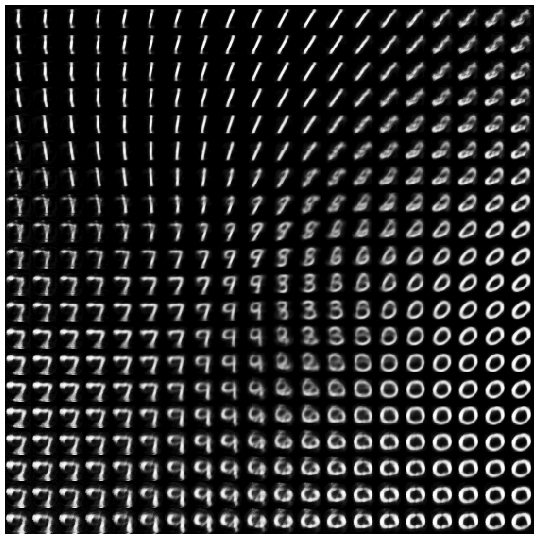

# Machine-Learning 2

Code for the labs of the Machine Learning 2 course at the University of Amsterdam.

### Lab 1 - Independent Component Analysis (ICA)  
* [Problem](lab1/) and [Code](lab1/)

### Lab 2 - Sum-Product and Max-Sum Algorithms

* [Problem](lab2/) and [Code](lab2/) 

### Lab 3 - Expectation Maximization and Variational Autoencoders

* [Problem](lab3/) and [Code](lab3/)

   
  <i> Expectation Maximization </i>
   
   
   
  <i> Learned Manifold of the VAE </i>

